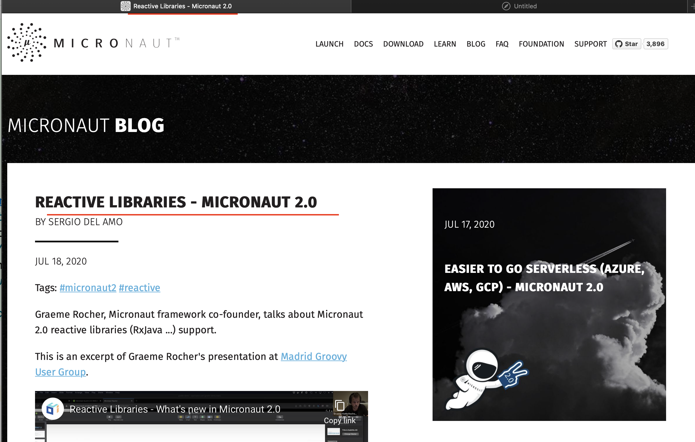
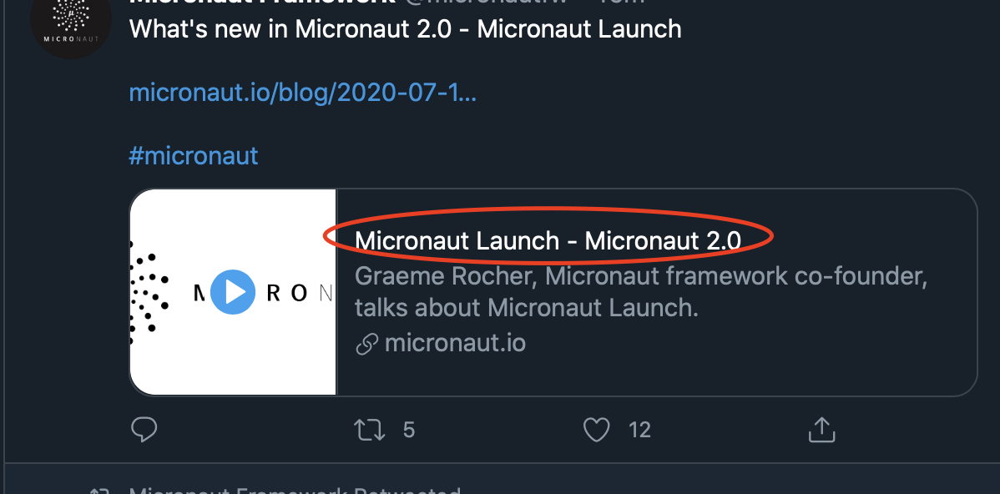
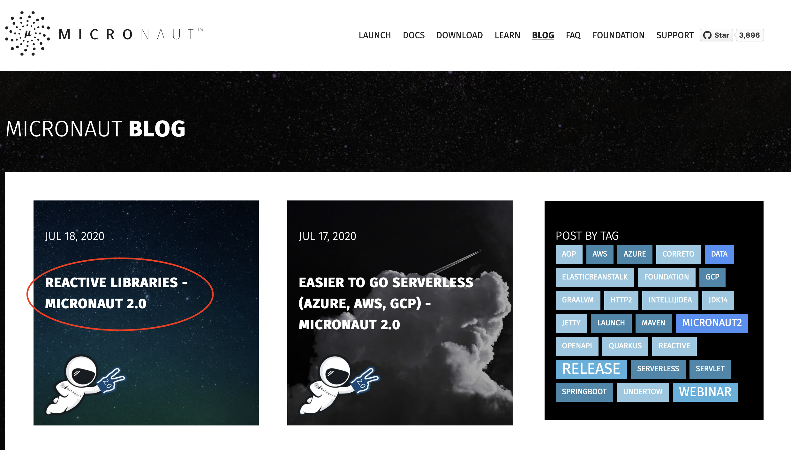
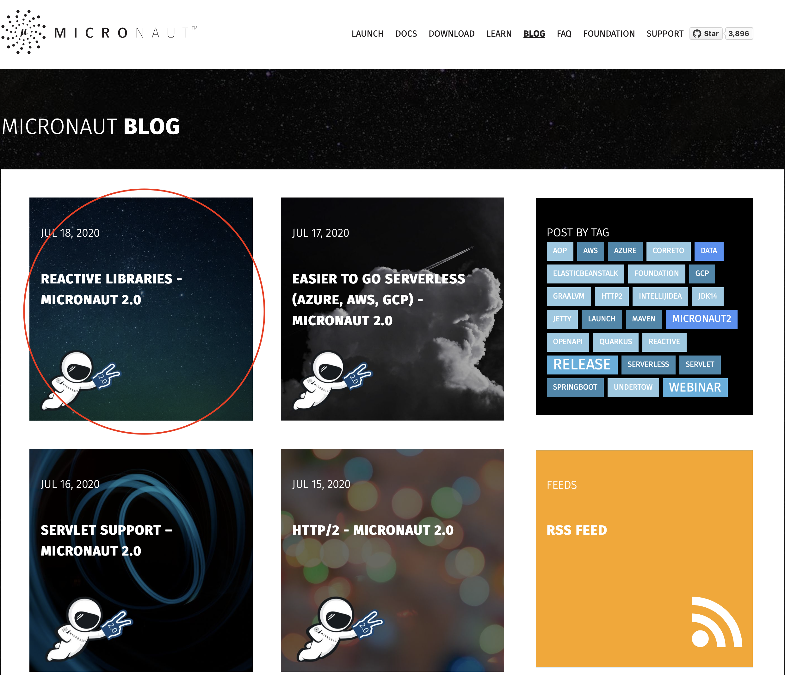

# Micronaut Website

[](https://github.com/micronaut-projects/static-website/actions)

This project builds the Micronaut website. A static website build with [Gradle](https://gradle.org).

## Blog Posts

### Posts Location

Write blog posts in markdown at `posts` folder.

### Blog post Metadata

A post supports metadata at the beginning of the document. You can use it store information (title, description, publication date) about your blog posts. 

Metadata must be separated from the rest of the document by three dashes.

You can use the metadata in the text by putting it in brackets adding a % sign.

A typical blog post will look like: 

```markdown
title: Micronaut Is Now Certified to Run on Amazon Corretto
date: April 9, 2020  
description: Users can now be assured that Micronaut is certified to run on Amazon Corretto, and we will continue our partnership with Amazon to ensure users don't run into any issues in production.
author: Álvaro Sánchez-Mariscal
---

# [%title]

[%author]

[%date] 

Tags: #aws #correto

One practice used by the [Micronaut development team](https://objectcomputing.com/products/2gm-team "Groovy, Grails, and Micronaut Team") is continuous integration (CI). In support of this, the [Micronaut framework](https://micronaut.io/ "Learn more about the Micronaut Framework")'s core has an extensive test suite executed via [GitHub Actions](https://github.com/features/actions), and since the beginning of 2020, tests have also been executed with [Amazon Corretto](https://aws.amazon.com/corretto/) 8 and 11.
```

#### Title Metadata

`title` tag is used as the window title, the card title, blog post main header and also in twitter cards.







#### Description Metadata

Description metadata is used as HTML meta description tag, and in twitter cards.

#### Date Metadata

Date is used to for publication date. It is used to order to blog posts. It is displayed in the UI and in the RSS feed.

Date can be expressed in `MMM d, yyyy`

```markdown
...
..
.
date: April 9, 2020  
---

```

or `MMM d, yyyy HH:mm`
 
```markdown
...
..
.
date: April 9, 2020 09:00
---

```

#### Blog post background

For Blog post background images usage image metadata. 

```markdown
...
..
.
image: 2018-05-23.jpg
---
```

Place the images at `assets/bgimages`



### Tags

To add tags just preffix them with `#`:

Example:

```markdown
Tags: #aws #correto
```

**Webinars on-demand recordings should be tagged with `webinar`**

Release announcements should be tagged with `release`. 

Check the [list of tags](https://micronaut.io/blog/index.html) and try to reuse them. Technology (e.g. GraalVM, Maven, Gradle), Programming concepts (AOP, Serverless, Servlet), Cloud Providers (AWS, GCP, Azure) or frameworks (SpringBoot, Quarkus) are good tags.

#### Code Highlighting

If your blog post, contains code samples add the following metadata:

```markdown
...
..
.
CSS: https://micronaut.io/stylesheets/prismjs.css
JAVASCRIPT: https://micronaut.io/javascripts/prismjs.js
---

# [%title]

```


## Assets (Fonts, Stylesheets, Images, Javascripts)

Assets used in the website can be found under `assets`. 

## What to change when a new release is published.

Please, modify `conf/releases.yml`

## Generating the MAIN site

[https://micronaut.io](https://micronaut.io)

```bash
./gradlew build
```

The output can be found in the `build/dist` directory.

# Generating the GUIDES site

[https://guides.micronaut.io](http://guides.micronaut.io)

```bash
./gradlew buildGuide
```

The output can be found in the `build/dist` directory.

## Generate Micronaut Launch Front end

Checkout in `launch` branch.